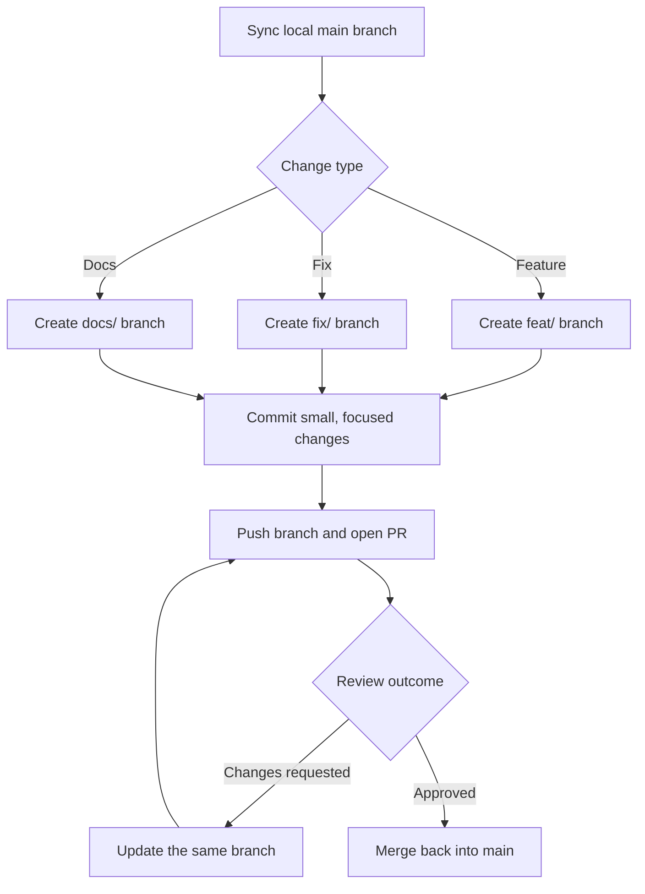

# Branching Workflow

This repository keeps the contribution flow simple: start from the latest default branch, do the work in a short-lived topic branch, open a pull request, and merge back after review.

## Flowchart



## Recommended branch names

- `feat/<topic>` for new features
- `fix/<topic>` for bug fixes
- `docs/<topic>` for documentation-only updates
- `chore/<topic>` for maintenance work that does not change user-facing behavior

Keep `<topic>` short, lowercase, and hyphenated, for example `docs/branching-workflow`.

## Working rules

1. Branch from the latest `main`.
2. Keep one logical change per branch.
3. Prefer small commits that are easy to review.
4. Use the same branch for follow-up review changes instead of opening a new PR.
5. Delete the branch after the PR is merged.

## Typical command sequence

```bash
git checkout main
git pull
git checkout -b docs/branching-workflow
# make changes
git add .
git commit -m "docs: add branching workflow guide"
git push origin docs/branching-workflow
```
