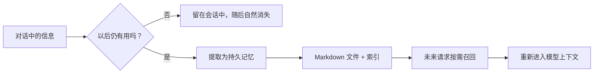
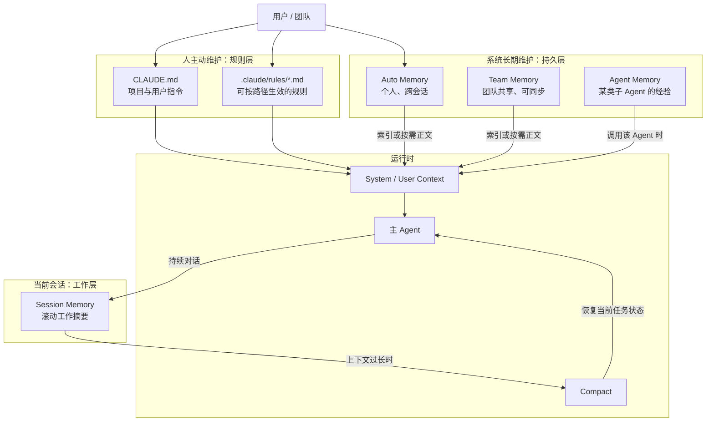
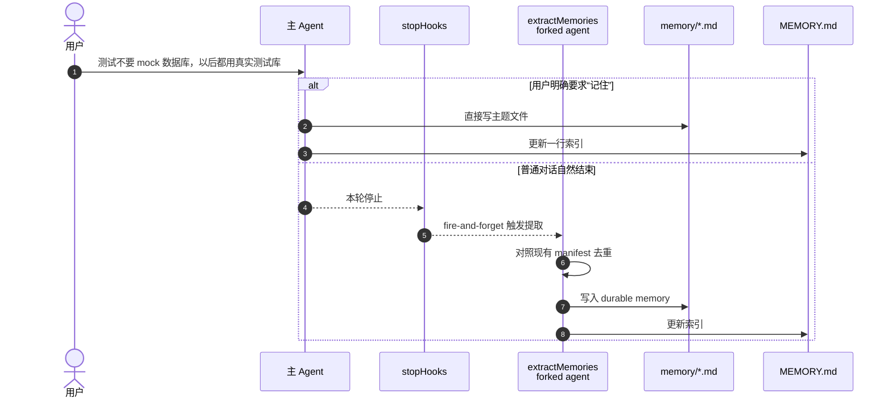
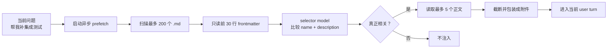
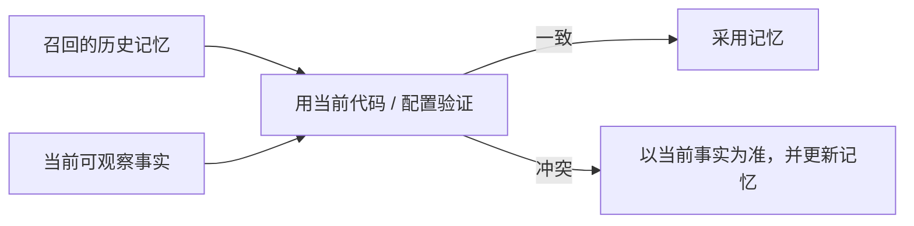
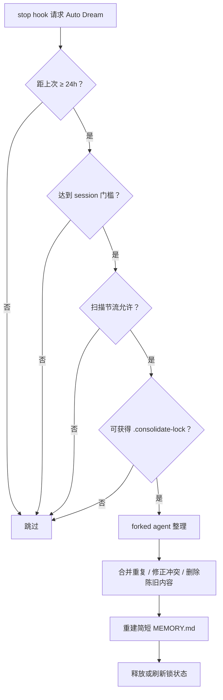
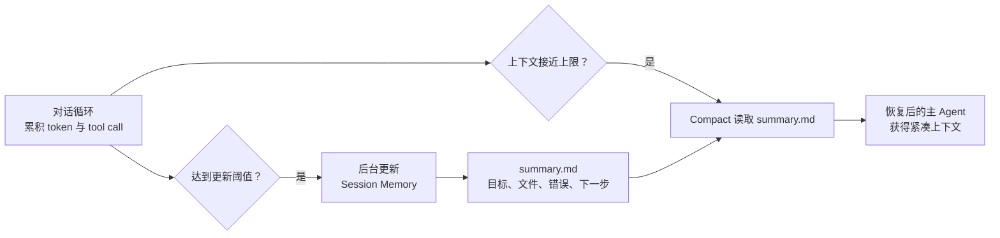
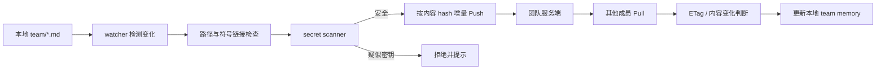
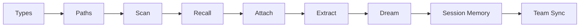
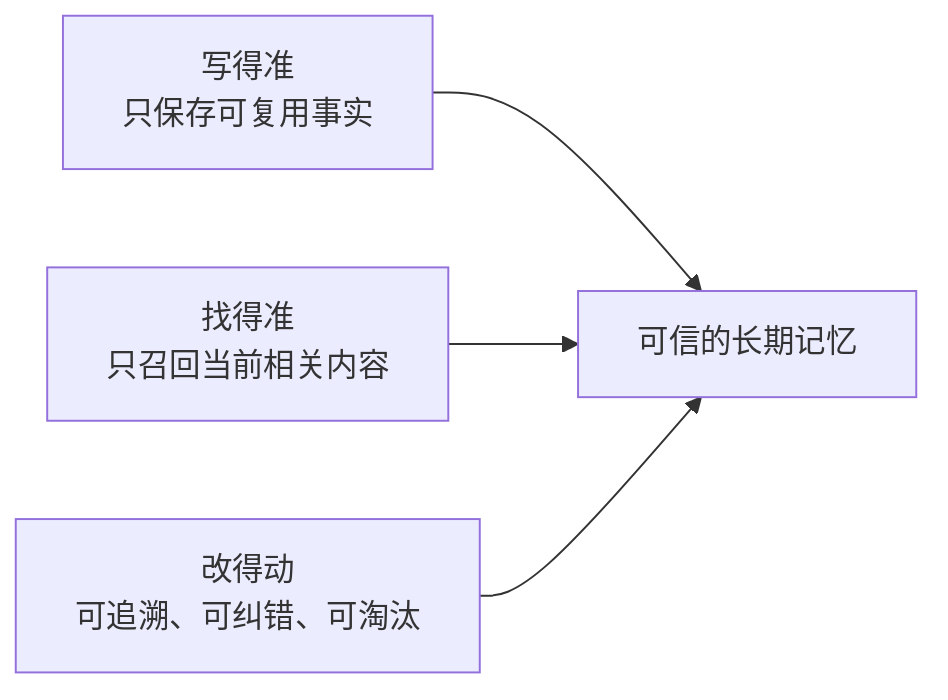

# Claude Code 记忆系统：从一条约定到跨会话召回

> 面向代码讲解的源码导读。目标不是罗列所有文件，而是回答三个问题：**记忆为什么存在、它如何流动、该从哪里读代码**。
>
> 本文基于仓库当前源码快照（`package.json` 版本 `2.1.87`）。功能开关和阈值可能随版本变化；源码路径与默认值以当前仓库为准。
>
> 叙事方式参考 [learn-claude-code / s09_memory](https://github.com/shareAI-lab/learn-claude-code/tree/main/s09_memory)，并在教学版的“存储—加载—提取—整理”之外补充本仓库中的 Session Memory、Team Memory、Agent Memory、权限边界与真实调用链。

---

## 0. 先用一个问题理解 Memory

用户在一次会话里说：

> “这个项目的测试不要 mock 数据库，以后都连接真实测试库。”

模型此刻能记住，因为这句话还在上下文窗口里。但随后会发生两件事：

1. 对话变长并触发 compact，细节可能被摘要成“用户对测试有偏好”；
2. 用户开启新会话，旧上下文不再存在。

所以记忆系统要解决的不是“模型有没有注意到”，而是：

> **如何把值得复用的信息移出易失的上下文窗口，并在未来恰当的时刻重新放回来。**

这也是理解全部代码的主线：



---

## 1. 一张图看懂全景

“Claude Code Memory”不是一个模块，而是五种职责不同的上下文机制。



| 机制 | 谁维护 | 生命周期 | 解决的问题 |
| --- | --- | --- | --- |
| `CLAUDE.md` / rules | 人 | 跨会话 | “必须遵守什么？” |
| Auto Memory | 人 + 后台提取器 | 跨会话 | “过去学到了什么？” |
| Team Memory | 团队 + 同步服务 | 跨用户、跨会话 | “团队共同知道什么？” |
| Agent Memory | Agent / 人 | 跨 Agent 调用 | “这个专家 Agent 学到了什么？” |
| Session Memory | 后台提取器 | 单个会话 | “当前任务做到哪里了？” |

最容易混淆的一点是：`CLAUDE.md` 在部分代码里也叫 memory file，但它属于**指令记忆**；Auto Memory 才是从会话中提炼并按需召回的**经验记忆**。

---

## 2. 一条记忆的一生

下面用“测试不要 mock 数据库”贯穿代码，而不是逐个模块背文件名。

### 2.1 创建：信息怎样离开对话

记忆有两条写入路径：

- **显式路径**：用户说“记住……”，主 Agent 直接写 memory 文件；
- **隐式路径**：回合结束后，`extractMemories` 的 forked agent 从近期对话提取稳定事实。



后台提取器故意采用受限 Agent：它跳过 transcript、限制轮数，并把工具权限收窄到 memory 目录。这样既减少成本，也避免“整理笔记”的任务获得不必要的工作区写权限。

代码入口：

- `src/query/stopHooks.ts`：回合结束后的触发点；
- `src/services/extractMemories/extractMemories.ts`：去重、并发保护、forked agent 与权限；
- `src/services/extractMemories/prompts.ts`：什么值得成为 durable memory。

### 2.2 存储：为什么是文件，而不是把全部内容塞进 Prompt

Auto Memory 使用“短索引 + 主题文件”结构：

```text
~/.claude/projects/<sanitized-git-root>/memory/
├── MEMORY.md                         # 短索引
├── testing-with-real-database.md     # 主题正文
├── release-workflow.md
└── team/                             # Team Memory（启用时）
    ├── MEMORY.md
    └── shared-ci-conventions.md
```

主题文件用 YAML frontmatter 提供低成本检索字段：

```markdown
---
name: testing-with-real-database
description: Tests in this project must use the real test database
type: feedback
---

Do not mock the database in integration tests. Use the isolated test database.

**Why:** mocked behavior previously diverged from production constraints.
**How to apply:** verify the test database is available before running the suite.
```

`MEMORY.md` 只保留“看到哪条索引就知道要不要继续读”的内容：

```markdown
- [Testing with real database](testing-with-real-database.md) — Integration tests must not mock the database
```

当前源码对索引设置了两道预算：最多 **200 行**、最多 **25 KB**。这体现了核心设计：

> 索引负责导航，正文负责承载事实；不要把索引写成第二份正文。

代码入口：`src/memdir/memdir.ts`、`src/memdir/memoryTypes.ts`、`src/memdir/paths.ts`。

### 2.3 召回：未来一轮怎样找回它

运行时不先读取全部正文，而是先扫描 frontmatter，再让轻量 side-query 选择相关文件。



关键点有四个：

1. **选择发生在读正文之前**：候选阶段只支付 header 成本；
2. **LLM 选择而非 embedding**：selector 根据当前问题与语义描述做高精度判断；
3. **最多选择 5 条**：避免记忆反过来挤占工作上下文；
4. **异步预取**：请求开始即启动，后续非阻塞收集，不让召回成为主链路的硬等待。

已经在当前 session 展示过的文件会通过 `alreadySurfaced` 一类状态过滤。注入内容还带有“可能过时”的提示：记忆是先验，不是不可质疑的事实；当源码现状与记忆冲突时，应信任当前证据。

代码入口：

- `src/memdir/memoryScan.ts`：扫描、frontmatter、mtime 排序与 200 文件上限；
- `src/memdir/findRelevantMemories.ts`：selector side-query；
- `src/utils/attachments.ts`：prefetch、正文读取、预算、去重与附件包装；
- `src/query.ts`：在主查询循环中启动和收集预取结果。

### 2.4 使用：记忆不是答案，只是约束与线索

召回的正文进入当前 user turn 后，主 Agent 会像使用其他上下文一样使用它：写测试时选择真实测试库，并在执行前核对当前仓库配置。

记忆系统不应该替模型做最终判断。正确顺序是：



### 2.5 整理：记忆多了以后怎么办

Auto Dream 不是每轮都执行。当前默认门控包括：距上次整理至少 **24 小时**、至少 **5 个 session** 有变化、扫描节流，以及没有其他整理进程持锁。



代码入口：`src/services/autoDream/autoDream.ts` 与 `src/services/autoDream/consolidationPrompt.ts`。

---

## 3. 五条源码链路

这一节适合边打开编辑器边讲。每条链路都只追一个问题。

### 3.1 指令文件如何进入上下文

```text
getMemoryFiles()
  ├─ 发现 User / Project / Local / Managed CLAUDE.md
  ├─ 发现 .claude/rules/*.md
  ├─ 处理 @include、嵌套目录与条件 paths
  └─ 返回 MemoryFileInfo[]
          ↓
filterInjectedMemoryFiles()
          ↓
getClaudeMds()
          ↓
getUserContext()
          ↓
当前会话上下文
```

主要文件：

- `src/utils/claudemd.ts`：发现、解析、缓存、条件规则和组合文本；
- `src/context.ts`：把结果放进用户上下文；
- `src/constants/prompts.ts`：通过 `loadMemoryPrompt()` 注入 memory 行为说明。

条件 rules 的核心不是“启动时一次性猜测哪些规则有用”，而是以目标文件路径匹配 frontmatter 中的 `paths`。因此修改 `src/**/*.ts` 时可以加载 TypeScript 规则，修改文档时不必承担这部分上下文。

### 3.2 Auto Memory 如何按需召回

```text
query.ts
  └─ startRelevantMemoryPrefetch(query)
       └─ getRelevantMemoryAttachments()
            ├─ scanMemoryFiles()
            ├─ findRelevantMemories()
            │    └─ selectRelevantMemories()
            └─ readMemoriesForSurfacing()
                 └─ attachments 注入当前 user turn
```

这里值得现场展示 `memoryScan.ts` 和 `findRelevantMemories.ts`：前者说明“便宜地列候选”，后者说明“语义地做选择”。这是整个系统最小、也最可复用的检索设计。

### 3.3 Durable Memory 如何写入

```text
query/stopHooks.ts
  └─ executeExtractMemories()
       ├─ 检查 feature / 重叠写入 / 并发状态
       ├─ 注入现有 memory manifest
       ├─ 创建受限 canUseTool
       └─ runExtraction()
            └─ forked agent 写 topic 文件与 MEMORY.md
```

为什么先把 manifest 给提取器？因为“发现已有记忆”本身会消耗一次工具调用，而且不知道已有内容就无法可靠去重。预先提供 `name + description`，能让 Agent 把有限轮数花在判断与写入上。

### 3.4 Session Memory 如何服务 Compact

Session Memory 不回答“下个月还要记住什么”，它回答“这项任务压缩后怎样继续”。它在对话中周期性更新结构化笔记，例如 Current State、Files and Functions、Errors & Corrections、Worklog。



默认配置来自 `sessionMemoryUtils.ts`，运行时还可能被远端配置或 inspector 环境变量覆盖。因此讲阈值时应称为“当前默认值”，不要把它们当协议：

- 首次初始化：约 10,000 token；
- 两次更新间增长：约 5,000 token；
- 工具调用阈值：约 3 次；
- token 增长条件始终必须满足，tool call 阈值或自然断点决定是否适合提取。

主要文件：

- `src/services/SessionMemory/sessionMemory.ts`：触发与更新；
- `src/services/SessionMemory/sessionMemoryUtils.ts`：配置和状态；
- `src/services/SessionMemory/prompts.ts`：结构化模板与内容预算；
- `src/services/compact/sessionMemoryCompact.ts`：compact 消费路径。

### 3.5 Team Memory 如何同步且避免泄密

Team Memory 在语义上仍是 durable memory，但存储在 `team/` 子目录，并多出远端同步和安全检查。



删除通常不能简单按“本地不存在”传播，否则一次误删可能清空团队知识。理解同步行为时要同时看同步索引、ETag/哈希与服务端语义，而不只看文件 watcher。

主要文件：

- `src/memdir/teamMemPaths.ts`、`src/memdir/teamMemPrompts.ts`；
- `src/services/teamMemorySync/index.ts`、`watcher.ts`；
- `src/services/teamMemorySync/secretScanner.ts`、`teamMemSecretGuard.ts`。

---

## 4. 三种最容易讲错的边界

### 4.1 MEMORY.md 是否“始终在 System Prompt”

更准确的说法是：

- `loadMemoryPrompt()` 会把记忆系统的**行为说明与路径**接入 system prompt；
- `MEMORY.md` 索引可由 CLAUDE.md 上下文链路加载；
- 当相关 feature 开启时，`filterInjectedMemoryFiles()` 会排除 AutoMem / TeamMem 索引，改由 relevant-memory attachment 路径按需提供内容。

所以不要把实现简化为“索引永远完整地塞进 system prompt”。真实代码为了 prompt cache 和上下文预算，会根据 feature 选择注入路径。

### 4.2 Auto Memory 与 Session Memory

| 维度 | Auto Memory | Session Memory |
| --- | --- | --- |
| 时间范围 | 跨会话 | 当前会话 |
| 内容 | 稳定偏好、反馈、项目事实、参考入口 | 当前目标、进度、文件、错误、下一步 |
| 组织 | 多个主题文件 + `MEMORY.md` | 一个滚动结构化摘要 |
| 消费者 | 未来 query 的召回器 | compact 与会话恢复 |
| 维护方式 | 显式写入 + stop hook 提取 + Dream | token / tool-call 门控的周期更新 |

判断口诀：**换个会话还值得知道吗？**值得就考虑 Auto Memory；只为当前任务续接，就放 Session Memory。

### 4.3 Agent Memory 与全局 Auto Memory

Agent Memory 把经验限制在某个专家 Agent 的上下文里，并支持 `user / project / local` scope。这样“安全审计 Agent 的检查套路”不会污染每一次普通对话。

入口在 `src/tools/AgentTool/agentMemory.ts`。调用 Agent 时加载，Agent 结束时保存；它与主对话 Auto Memory 的**受众不同**，不应仅因为都叫 memory 就合并。

---

## 5. 设计取舍：为什么这套机制有效

### 5.1 文件系统而非数据库

优势是可读、可编辑、可审计、能使用现有文件工具，并天然适合 Git 式工作流。代价是需要自己处理索引膨胀、并发锁、frontmatter 质量与冲突合并。

### 5.2 LLM selector 而非全量注入

全量注入最简单，却会使 token 成本随记忆量线性增长，并把无关历史变成噪音。先读 header 再选正文，把成本从“全部正文”降为“短目录 + 少量命中正文”。

### 5.3 后台提取而非要求用户手动维护

用户不会总说“请记住”。stop hook 能捕捉自然对话中的稳定偏好；forked agent 与权限边界则防止后台维护阻塞主回答或扩大写入面。

### 5.4 记忆必须允许被推翻

项目、依赖和用户偏好都会变化。系统通过新鲜度提示、Dream 冲突整理和“当前证据优先”降低 memory drift。好的记忆不是永久真理，而是**带来源、时间和适用范围的可修正先验**。

---

## 6. 如何现场演示

建议分四轮执行，而不是一次把答案说完：

1. `记住：这个项目的集成测试不要 mock 数据库。`
2. 查看 memory 目录中新文件与 `MEMORY.md` 的变化。
3. 开启新会话，提问：`帮我给用户仓储补一条集成测试。`
4. 观察相关 memory 是否被召回，以及 Agent 是否先核验当前测试配置。

观察清单：

- 写入的是主题文件，还是把全文堆进 `MEMORY.md`？
- frontmatter 的 `description` 能否让人不读正文就判断相关性？
- 新一轮是否只召回相关文件，而不是全量加载？
- 同一 session 是否避免重复 surfacing？
- 记忆与当前代码冲突时，Agent 是否以当前证据为准？

如果要演示 Session Memory，再做一个长任务并触发 compact，重点观察压缩前后 Current State、Errors & Corrections 和下一步是否仍然连续。

---

## 7. 推荐源码阅读顺序

不要从最大的文件开始。按数据流读，理解成本最低：

1. `src/memdir/memoryTypes.ts`：先认识数据模型；
2. `src/memdir/paths.ts`：知道文件究竟放在哪里；
3. `src/memdir/memoryScan.ts`：理解候选如何被廉价扫描；
4. `src/memdir/findRelevantMemories.ts`：理解 selector 如何挑选；
5. `src/utils/attachments.ts`：理解正文如何进入当前 turn；
6. `src/services/extractMemories/extractMemories.ts`：反向追写入；
7. `src/services/autoDream/autoDream.ts`：看长期维护；
8. `src/services/SessionMemory/sessionMemory.ts`：最后对比会话记忆；
9. `src/services/teamMemorySync/index.ts`：需要团队能力时再深入同步。



---

## 8. 可继续演进的方向

当前实现已经解决“存、选、读、写、整”，下一步更有价值的不是盲目增加记忆数量，而是增加可解释性：

- **来源追溯**：记忆关联 source session / source message，能回答“这条结论从哪来”；
- **召回解释**：记录本轮为什么选中、为什么排除某条 memory；
- **冲突模型**：不直接覆盖矛盾事实，而是保留时间、证据和适用范围；
- **LLM Wiki / 知识图谱**：主题文件之间建立实体和关系，为图谱化检索奠定基础；
- **质量指标**：跟踪召回后是否真正被使用、是否被当前事实否决、是否导致用户纠正。

最终，记忆系统的质量不由“存了多少”决定，而由三个指标决定：



---

## 9. 总结

Claude Code 的记忆机制可以压缩成一句话：

> **用指令文件定义长期规则，用主题文件保存跨会话经验，用轻量 selector 按需召回，用 Session Memory 穿过 compact，再用后台 Agent 持续提取和整理。**

如果只记住一条源码主线，请记住：

```text
对话结束写入
  stopHooks → extractMemories → memory/*.md + MEMORY.md

未来请求召回
  query → memoryScan → selectRelevantMemories → attachments → 主 Agent

长期维护
  stopHooks → autoDream → 去重 / 修正 / 剪枝 / 重建索引
```

这三条链路连起来，就是一条记忆从产生、持久化、被找回，到最终被修正或淘汰的完整生命周期。

---

# 附录：演示用 Prompt 中文翻译

> 本附录是当前源码 Prompt 的**忠实中文意译**，用于演示时切换窗口讲解，不参与程序运行。变量保留 `{{...}}` 或 `<...>` 形式，便于说明运行时会注入什么。为提高可读性，重复出现的文件格式和四类记忆定义只完整展示一次。

## A. Auto Memory 行为 Prompt

**触发位置**：构建 system prompt 时，由 `src/memdir/memdir.ts` 的 `buildMemoryLines()` / `loadMemoryPrompt()` 生成。

**演示重点**：它不是某一轮的任务提示，而是告诉主 Agent“什么值得记、怎样存、什么时候读、怎样验证”。

```text
# 自动记忆

你在以下目录拥有一个基于文件的持久记忆系统：
{{memoryDir}}
该目录已经存在，你可以直接读取和写入，不需要先创建它。

你应该随着时间推移逐步完善这套记忆，使未来对话能完整理解：
- 用户是谁；
- 用户希望怎样与你协作；
- 哪些行为应该避免或继续；
- 用户交给你的工作背后有什么上下文。

如果用户明确要求你记住某件事，应立即选择最合适的类型保存。
如果用户要求遗忘某件事，应找到并删除对应条目。

## 记忆类型

### user
保存用户的角色、目标、职责、知识背景与稳定偏好。
目的是让未来协作适合这个具体用户，而不是对用户做无关或负面的评价。

何时保存：得知用户角色、偏好、职责或知识水平时。
如何使用：根据用户的背景调整解释方式、协作深度与信息密度。

### feedback
保存用户关于“工作应该怎样做”的指导，包括要避免的做法和已经验证有效的做法。
既要记录纠正，也要记录非显而易见的正向确认；只记录失败会让行为越来越保守。

何时保存：用户纠正方法，或确认某个不寻常的判断是正确的，并且它对未来仍有用时。
正文结构：先写规则，再写 **Why:**，最后写 **How to apply:**。

### project
保存无法仅靠读取代码重新推导的项目背景，例如一项工作的原因、跨系统约束、关键决策。
不要把当前任务进度或可以直接从代码看出的结构当成 project memory。

### reference
保存外部信息在哪里，例如看板、文档、工单、沟通频道或排障入口。
重点是“去哪里找”，而不是复制外部系统的全部内容。

## 不应保存什么

- 可从当前项目重新推导的代码模式、约定、架构、文件路径或目录结构；
- Git 历史、近期变更或谁修改了什么；`git log` / `git blame` 才是权威来源；
- 调试方案或修复配方；修复已在代码里，背景通常在提交信息里；
- 已写入 CLAUDE.md 的内容；
- 临时任务细节、进行中的状态、当前对话上下文。

即使用户明确要求保存，上述排除规则仍然适用。
如果用户要求保存本周 PR 列表或活动摘要，应询问其中有什么“令人意外或无法直接推导”的信息；那部分才值得保存。

## 怎样保存

保存分两步：

第一步：每条记忆写入独立主题文件，例如 user_role.md、feedback_testing.md：

---
name: {{记忆名称}}
description: {{用于未来判断相关性的一行具体描述}}
type: {{user | feedback | project | reference}}
---

{{记忆正文；feedback/project 应包含事实或规则、Why、How to apply}}

第二步：在 MEMORY.md 添加指向该文件的一行索引：
- [标题](file.md) — 一句话检索钩子

MEMORY.md 是索引，不是记忆正文：
- 每行尽量少于约 150 个字符；
- 不要直接把正文写进 MEMORY.md；
- 超过 200 行的部分会被截断；
- 按语义主题组织，不要按时间流水账组织；
- 内容变化时同步更新 name、description 和 type；
- 错误或过时的记忆应更新或删除；
- 写新文件前先检查能否更新已有文件，避免重复。

## 何时访问记忆

- 记忆看起来与当前问题相关，或用户提到以前对话中的工作时；
- 用户明确要求检查、回忆或记住时，必须访问；
- 如果用户要求忽略或不使用记忆，就把 MEMORY.md 当成空文件：不要使用、引用、比较或提及任何记忆内容。

记忆会随时间过时。把它视为“某个时刻成立的上下文”，不要视为永久事实。
仅根据记忆回答或建立假设前，应读取当前文件或资源验证。
如果记忆与当前观察冲突，以当前事实为准，并更新或删除旧记忆。

## 根据记忆提出建议之前

记忆里出现某个函数、文件或开关，只能证明它在记忆写入时被认为存在。
它后来可能被改名、删除，甚至从未合并：
- 文件路径：检查文件是否存在；
- 函数或开关：搜索当前代码；
- 用户即将依据建议采取行动：先验证，再建议。

“记忆说 X 存在”不等于“X 现在存在”。
如果用户询问最近或当前状态，应优先读取代码或 Git 历史，而不是复述旧快照。

## 与其他持久化机制的区别

- 非平凡实现开始前需要与用户对齐方案：使用 Plan，而不是 Memory；
- 当前会话需要拆分步骤和跟踪进度：使用 Tasks，而不是 Memory；
- 只有未来会话仍然有用的信息，才适合进入 Memory。
```

## B. Relevant Memory 选择 Prompt

**触发位置**：`src/memdir/findRelevantMemories.ts` 的 `SELECT_MEMORIES_SYSTEM_PROMPT`。

**演示重点**：召回采用高精度策略——不确定就不选；“正在使用某工具”时排除普通参考文档，但保留坑点和警告。

```text
你正在选择一些记忆，帮助 Claude Code 处理用户当前的请求。
你会收到用户请求，以及可用记忆文件的文件名和描述。

返回那些明确会帮助 Claude Code 处理当前请求的记忆文件名，最多 5 个。
只有当你根据文件名和描述确定它有帮助时，才把它加入结果。

- 如果不确定某条记忆是否有用，就不要选择。保持严格和克制。
- 如果没有任何记忆明确有用，可以返回空列表。
- 如果输入包含“最近使用的工具”：
  - 不要选择这些工具的普通用法参考或 API 文档，因为 Claude Code 已经在实际使用它们；
  - 仍然要选择这些工具的警告、坑点和已知问题，因为正在使用时正是它们最重要的时候。

用户请求：
{{query}}

可用记忆：
{{filename + name + description manifest}}

最近使用的工具：
{{recentTools，可为空}}

严格返回符合以下结构的 JSON：
{
  "selected_memories": ["memory-a.md", "memory-b.md"]
}
```

## C. Extract Memories 后台提取 Prompt

**触发位置**：`src/services/extractMemories/prompts.ts`。

**演示重点**：这个 Agent 只处理最近消息、不能重新调查源码、读取与写入要批量并行，并且必须先对照现有 manifest 去重。

```text
你现在是“记忆提取子代理”。分析上方最近约 {{newMessageCount}} 条消息，
使用这些消息更新持久记忆系统。

可用工具：
- FileRead、Grep、Glob；
- 只读 Bash（ls/find/cat/stat/wc/head/tail 等）；
- 仅允许在 memory 目录内使用 FileEdit / FileWrite。

禁止事项：
- Bash rm 不允许；
- MCP、Agent、可写 Bash 等其他工具都会被拒绝。

你的回合预算有限。FileEdit 要求先读取同一文件，因此最高效的策略是：
1. 第一回合，并行读取所有可能需要更新的文件；
2. 第二回合，并行执行全部 FileWrite / FileEdit；
3. 不要把多个文件的读写交错到许多回合里。

只能使用最近约 {{newMessageCount}} 条消息中的内容更新持久记忆。
不要浪费回合重新调查或验证：
- 不要 grep 项目源码；
- 不要读取代码确认某个模式；
- 不要执行 Git 命令。

## 现有记忆文件

{{existingMemories manifest}}

写入前检查这个列表。优先更新已有文件，不要创建重复记忆。

如果用户明确要求记住某件事，选择最合适的类型立即保存。
如果用户要求遗忘，找到并删除相关条目。

按照 Auto Memory 行为 Prompt 中的四种类型与“不应保存什么”规则做判断。

## 保存方式

1. 将每条记忆写入独立的主题文件；
2. 使用 name / description / type frontmatter；
3. 在 MEMORY.md 写入一行指针，不把正文写进索引；
4. 按主题组织，不写时间流水账；
5. 更新或删除错误、过时内容；
6. 先查重，再新建。
```

### C.1 同时启用 Team Memory 时增加的路由要求

```text
为每条记忆选择 private 或 team 目录：

- user：始终 private；
- feedback：默认 private。只有明确属于所有贡献者都应遵守的项目级约定，才进入 team；
- project：个人工作背景放 private，稳定且全团队有用的项目背景可放 team；
- reference：私人入口放 private，团队共享的文档、看板、频道入口可放 team。

每个目录都有自己的 MEMORY.md，主题文件和索引必须写在同一个 scope。
共享 Team Memory 中严禁保存 API Key、用户凭据等敏感信息。
```

## D. Auto Dream 整理 Prompt

**触发位置**：`src/services/autoDream/consolidationPrompt.ts` 的 `buildConsolidationPrompt()`。

**演示重点**：Dream 不是“重新总结全部历史”，而是定向收集近期信号、合并主题、修正漂移、压缩索引。

```text
# Dream：记忆整理

你正在执行一次 Dream——对记忆文件进行反思式整理。
把近期学到的内容综合成持久、组织良好的记忆，使未来会话能快速进入状态。

Memory 目录：{{memoryRoot}}
Session transcript：{{transcriptDir}}
transcript 是大型 JSONL 文件：只做窄范围 grep，不要完整读取。

## 阶段 1：建立方位感

- ls memory 目录，了解已有内容；
- 阅读 MEMORY.md，理解当前索引；
- 浏览现有主题文件，优先改进它们而不是创建重复文件；
- 如果存在 logs/ 或 sessions/，查看近期条目。

## 阶段 2：收集近期有效信号

按大致优先级查找值得长期保存的新信息：
1. Daily logs（如果存在），它们是追加写入的信号流；
2. 已发生漂移的旧记忆，即与当前代码事实冲突的内容；
3. 只有需要特定背景时，才用窄关键词搜索 transcript。

不要穷举读取 transcript。只寻找你已经有理由怀疑很重要的内容。

## 阶段 3：合并整理

对每项值得记忆的内容，在 memory 根目录写入或更新主题文件。
以 system prompt 中的 auto-memory 类型、格式和排除规则为唯一标准。

重点：
- 把新信号合入已有主题文件，不制造近似重复；
- 把“昨天”“上周”等相对日期改为绝对日期；
- 如果今天的调查推翻旧事实，就从源头修正或删除旧记忆。

## 阶段 4：剪枝并更新索引

更新 MEMORY.md，使其保持在 200 行和约 25 KB 以内。
它是索引，不是内容堆放处。每项应是一行、少于约 150 字符：
- [标题](file.md) — 一句话检索钩子

- 删除指向陈旧、错误或已被取代记忆的索引；
- 索引行超过约 200 字符时，把细节移回主题文件并缩短索引；
- 增加新重要记忆的指针；
- 两个文件发生冲突时，修正错误的一方。

最后简短说明合并、更新或剪枝了什么。
如果记忆已经足够紧凑、无需修改，也要明确说明。

附加上下文：
{{extra，可为空}}
```

## E. Session Memory 结构模板

**触发位置**：`src/services/SessionMemory/prompts.ts` 的 `DEFAULT_SESSION_MEMORY_TEMPLATE`。

**演示重点**：这是当前会话的滚动工作台，不是长期用户画像。

```markdown
# Session Title
_用 5-10 个词给会话起一个短小、独特、信息密度高的标题，不写空话。_

# Current State
_现在正在做什么？哪些任务尚未完成？紧接着应该做什么？_

# Task specification
_用户要求构建什么？有哪些设计决策和解释性背景？_

# Files and Functions
_哪些文件和函数最重要？它们包含什么，为什么相关？_

# Workflow
_通常按什么顺序执行哪些命令？不明显的输出应该怎样解读？_

# Errors & Corrections
_遇到过什么错误，怎样修复？用户纠正了什么？哪些失败方法不应再试？_

# Codebase and System Documentation
_哪些系统组件最重要？它们如何工作和协作？_

# Learnings
_什么有效，什么无效，应避免什么？不要重复其他章节。_

# Key results
_如果用户要求了具体答案、表格或文档，在这里保留完整、准确的结果。_

# Worklog
_逐步记录尝试和完成了什么，每步保持非常简短。_
```

## F. Session Memory 更新 Prompt

**触发位置**：`src/services/SessionMemory/prompts.ts` 的 `getDefaultUpdatePrompt()`。

**演示重点**：只允许编辑既有结构；这些提示本身不能泄漏进笔记；`Current State` 永远要反映最新状态。

```text
重要：这条消息和这些指令不属于真实用户对话。
不要在笔记中提及“记笔记”“提取 Session Notes”或本更新指令。

根据上方真实用户对话更新 Session Notes 文件，但排除：
- 当前这条记笔记指令；
- system prompt；
- CLAUDE.md 内容；
- 过去的 Session Summary。

文件 {{notesPath}} 已经为你读取，当前内容如下：
<current_notes_content>
{{currentNotes}}
</current_notes_content>

你的唯一任务是使用 Edit 更新这个文件，然后停止。
可以进行多处编辑，但所有 Edit 调用应在一条消息中并行发出。
不要调用任何其他工具。

编辑规则：
- 必须原样保留全部章节、标题和斜体说明；
- 绝不能修改、删除或增加以 # 开头的章节标题；
- 绝不能修改或删除每个标题后的斜体模板说明；
- 只能更新斜体说明下方的实际内容；
- 不要在既有结构外增加章节、摘要或信息；
- 没有实质新内容的章节可以不更新，不要填“暂无信息”等空话；
- 内容要具体且高密度，包括路径、函数、错误文本、准确命令和技术细节；
- Key results 必须保留用户要求的完整结果；
- 不要重复 CLAUDE.md 已经包含的信息；
- 每节接近约 2,000 token 时，移除较次要信息并保留最关键内容；
- 内容应帮助后来者理解或复现当前工作；
- 必须让 Current State 反映最新工作，这是 compact 后连续性的关键。

使用 Edit，file_path 为：{{notesPath}}

编辑完成后立即停止。
```

## G. 演示切换顺序

演示时可以按下面顺序切换窗口，每个 Prompt 只回答一个问题：

| 窗口 | 展示内容 | 讲解问题 |
| --- | --- | --- |
| 1 | A. Auto Memory 行为 Prompt | 什么值得记，什么不该记？ |
| 2 | C. Extract Memories | 对话结束后是谁写入的？权限为何受限？ |
| 3 | B. Relevant Memory Selector | 新问题到来时，怎样从许多记忆中选出最多 5 条？ |
| 4 | D. Auto Dream | 记忆变多、变旧、互相矛盾后怎么办？ |
| 5 | E + F. Session Memory | 当前任务怎样穿过 compact，而不污染长期记忆？ |
| 6 | C.1 Team Scope | 哪些内容可以共享，怎样避免泄密？ |

一条适合收尾的总结是：

> 行为 Prompt 定义规则，Extract Prompt 负责写入，Selector Prompt 负责找回，Dream Prompt 负责维护，Session Prompt 负责让当前任务穿过压缩。
