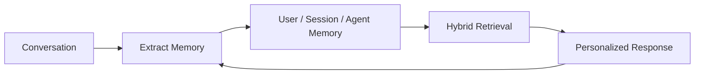
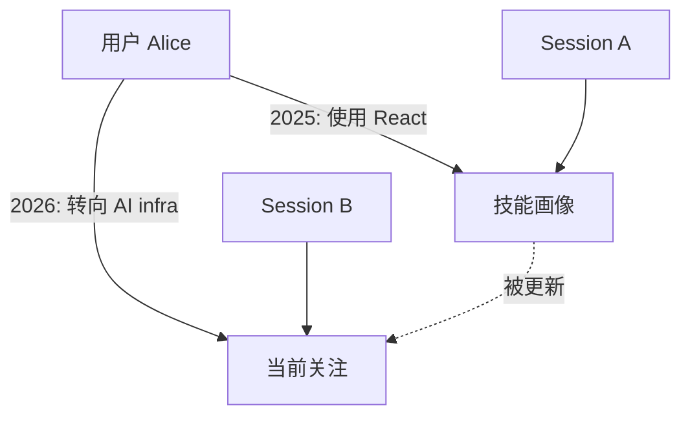
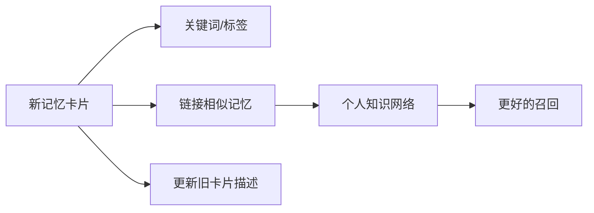
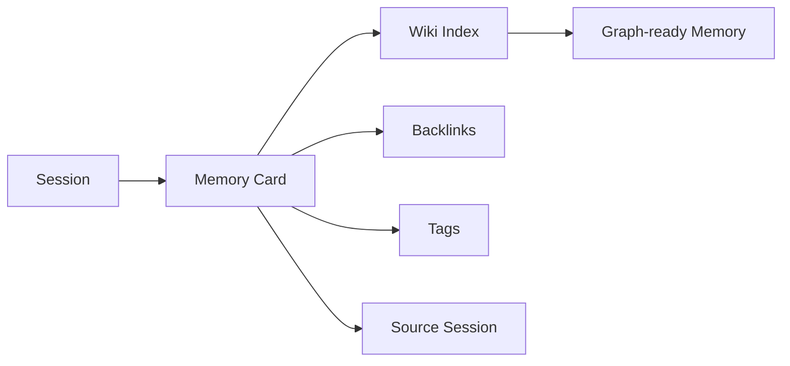
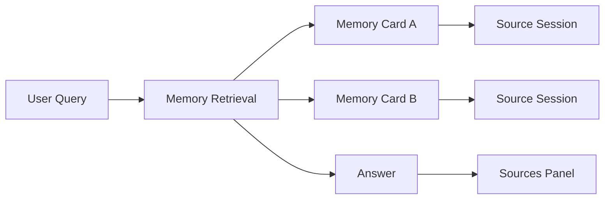
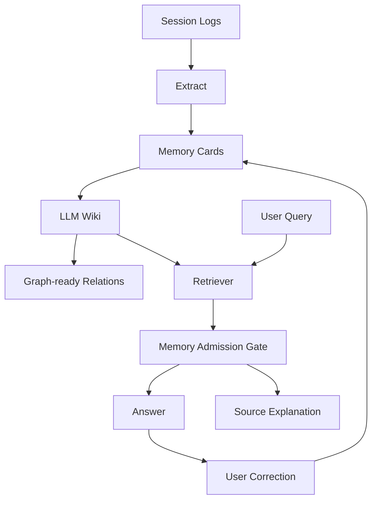

# 大模型记忆业界洞察

从聊天历史，到个人 LLM Wiki，再到可解释的记忆图谱

<div class="mt-8 text-sm opacity-70">
2026-06-16 · Slidev deck · 可导出为 PPTX
</div>

<!--
讲法：今天不讲“怎么把当前项目接进去”，而讲行业里大家已经验证过的方向，以及哪些形态对非专家也容易理解。
-->

---

# 一句话结论

大模型记忆不是“把更多聊天塞进上下文”。

它正在变成一个独立的产品与基础设施层：

<div class="grid grid-cols-3 gap-4 mt-8">
<div class="p-4 border rounded">
<div class="text-xl font-bold">可组织</div>
<div class="text-sm opacity-75 mt-2">记忆卡片、标签、链接、命名空间</div>
</div>
<div class="p-4 border rounded">
<div class="text-xl font-bold">可解释</div>
<div class="text-sm opacity-75 mt-2">回答用了哪些来源，为什么用了</div>
</div>
<div class="p-4 border rounded">
<div class="text-xl font-bold">可治理</div>
<div class="text-sm opacity-75 mt-2">权限、删除、遗忘、审计、评估</div>
</div>
</div>

---

# 为什么现在重要

过去的 AI 助手像“每次重新认识你”。

记忆层让 AI 能跨 session 保持连续性：

- 不重复询问用户偏好、项目背景、常用工具
- 能理解“上次那个方案”“我习惯的写法”“这个团队的规则”
- 能把孤立对话沉淀成个人知识网络
- 能解释自己为什么引用某段历史信息

<div class="mt-8 text-sm opacity-70">
非专家类比：记忆层 = AI 的个人笔记本 + 索引 + 引用来源。
</div>

---

# 业界样本

<table>
<thead>
<tr><th>代表</th><th>定位</th><th>信号</th><th>值得借鉴</th></tr>
</thead>
<tbody>
<tr><td>ChatGPT Memory</td><td>大众产品</td><td>最强用户认知</td><td>来源解释、可编辑、可关闭</td></tr>
<tr><td>Mem0</td><td>记忆基础设施</td><td>高 stars 开源项目</td><td>多级记忆、实体链接、混合检索</td></tr>
<tr><td>LangGraph</td><td>Agent 框架</td><td>高 stars 开源项目</td><td>短期/长期、命名空间、分类法</td></tr>
<tr><td>Graphiti / Zep</td><td>时间知识图谱</td><td>高 stars 开源项目</td><td>事实随时间变化、来源追溯</td></tr>
<tr><td>Letta</td><td>状态型 Agent</td><td>高 stars 开源项目</td><td>可编辑状态、memory blocks</td></tr>
</tbody>
</table>

<div class="mt-6 text-xs opacity-60">
演示时可打开对应 GitHub 链接查看实时 star 数；这里避免写死会快速变化的数字。
</div>

---

# 例子 1：ChatGPT Memory

ChatGPT 的方向很明确：

- 自动从聊天、文件、连接应用中学习有用上下文
- 提供 memory summary，让用户看到“它记住了什么”
- 回答下方提供 sources，可以看到本次回答用了哪些记忆来源
- 支持纠正、“不要再提”、关闭记忆

<div class="mt-8 p-4 border rounded">
<div class="font-bold">启发</div>
<div class="mt-2">记忆越自动，越需要解释和控制。否则用户会觉得 AI “莫名其妙地知道了什么”。</div>
</div>

---

# 例子 2：Mem0

Mem0 把 memory 当成独立基础设施：

- 面向 AI agents 的通用 memory layer
- 支持 user、session、agent 多级记忆
- 提供 library、自托管 server、cloud platform
- 新版强调 entity linking、BM25 + semantic + entity 的多信号检索、temporal reasoning



<div class="mt-4 text-sm opacity-70">
启发：记忆层可以独立演进，不必绑死在单个模型或单个产品界面里。
</div>

---

# 例子 3：Graphiti / Zep

Graphiti 的核心视角：AI 需要的是 temporal context graph。

也就是：

- 事实不是静态文档，事实会随时间变化
- 每条事实要保留 provenance，知道从哪里来
- 新对话、新业务数据可以增量进入图
- 查询时既能问“现在是什么”，也能问“当时是什么”



---

# 例子 4：A-MEM 与 LLM Wiki

A-MEM 的思路非常适合“个人 LLM Wiki”：

每条新记忆不只是文本，而是一张可链接的 note：

- 摘要描述
- 关键词
- 标签
- 与旧记忆的关联
- 触发旧记忆更新



<div class="mt-4 text-sm opacity-70">
启发：先做 Wiki 式记忆卡片和链接，再自然演进成图谱。
</div>

---

# 例子 5：Letta

Letta 把 agent 看成 stateful agent：

- Agent 会积累状态、行为、事实和过去交互
- memory blocks 让核心记忆可编辑、可组合
- shared memory 支持多个 agent 共享上下文
- archival memory 支持更大的长期资料检索

<div class="mt-8 p-4 border rounded">
<div class="font-bold">启发</div>
<div class="mt-2">记忆不是一坨聊天记录，而是 agent 的状态。状态需要结构、边界和编辑入口。</div>
</div>

---

# 例子 6：LangGraph

LangGraph 给了一个很适合讲解的分类法：

<div class="grid grid-cols-2 gap-6 mt-6">
<div>
<div class="text-xl font-bold">短期记忆</div>
<ul>
<li>thread / session scoped</li>
<li>当前对话、上传文件、临时状态</li>
<li>适合 resume 和上下文连续</li>
</ul>
</div>
<div>
<div class="text-xl font-bold">长期记忆</div>
<ul>
<li>跨 session</li>
<li>放在 namespace 里</li>
<li>可在任意线程召回</li>
</ul>
</div>
</div>

长期记忆还能分成：

`semantic` 事实 · `episodic` 经历 · `procedural` 规则

---

# 从 Memory 到 LLM Wiki

LLM Wiki 是一个中间形态：

比纯 markdown 更结构化，比图数据库更轻。



每张卡片建议至少包含：

- `title / summary / type`
- `source_session / source_message`
- `created_at / updated_at / last_verified_at`
- `tags / entities / related`
- `supersedes / conflicts_with`

---

# LLM Wiki 的好处

给非专家讲，可以用三个词：

<div class="grid grid-cols-3 gap-4 mt-8">
<div class="p-4 border rounded">
<div class="text-xl font-bold">能看懂</div>
<div class="text-sm mt-2 opacity-75">像 Notion / Obsidian，而不是黑盒向量库</div>
</div>
<div class="p-4 border rounded">
<div class="text-xl font-bold">能链接</div>
<div class="text-sm mt-2 opacity-75">记忆之间有关系，不只是关键词命中</div>
</div>
<div class="p-4 border rounded">
<div class="text-xl font-bold">能进化</div>
<div class="text-sm mt-2 opacity-75">旧事实被更新、替代、标记冲突</div>
</div>
</div>

<div class="mt-8 text-sm opacity-70">
这也是后续做知识图谱的低风险路径：先把节点和边自然沉淀出来。
</div>

---

# 来源解释：为什么必须做

没有来源解释时，用户只能猜：

> “AI 为什么突然说我喜欢这个风格？”

有来源解释后，系统可以回答：

> “因为本次回答引用了 Session 2026-05-21 中你确认过的偏好，以及 memory card `review-tone-preference`。”



---

# 来源解释可以怎么展示

建议展示成“回答来源卡片”：

<div class="p-4 border rounded mt-6">
<div class="font-bold">本次使用的记忆</div>
<div class="mt-3 text-sm">
1. <b>review-tone-preference</b> · feedback · 12 天前更新<br>
来源：Session #abc123，第 18 轮用户反馈<br>
为什么使用：当前问题是代码 review，匹配“输出风格偏好”。
</div>
<div class="mt-3 text-sm">
2. <b>memory-graph-roadmap</b> · project · 3 天前更新<br>
来源：Session #def456，用户确认 roadmap<br>
为什么使用：当前问题涉及 LLM Wiki 和图谱演进。
</div>
</div>

<div class="mt-6 text-sm opacity-70">
用户动作：打开源 session、纠正、不要再提、删除、标记过期。
</div>

---

# 关键风险：记忆是信任边界

2026 年 MemGate 论文指出：

语义相似不等于“应该使用”。

错误记忆可能导致：

- 跨领域泄漏：把 A 项目的偏好带到 B 项目
- 迎合倾向：过度迁就历史偏好
- 工具调用漂移：旧经验影响新任务执行
- memory-induced jailbreak：恶意记忆长期影响行为

<div class="mt-8 p-4 border rounded">
<div class="font-bold">启发</div>
<div class="mt-2">检索不是最后一步；召回后还需要 admission gate：这条记忆当前能不能用？</div>
</div>

---

# 推荐架构图



<div class="mt-4 text-sm opacity-70">
重点：先把 memory card、source_session、related/conflicts/supersedes 做扎实，图谱是自然结果。
</div>

---

# 最小可行方案

第一阶段不用上复杂图数据库：

```yaml
---
id: review-tone-preference
type: feedback
summary: 用户偏好直接列出 review 风险，少写寒暄。
source_session: "2026-05-21-abc123"
source_message: "turn-18"
entities: ["code review", "communication preference"]
tags: ["review", "style"]
related: ["pull-request-review-format"]
supersedes: []
conflicts_with: []
last_verified_at: "2026-06-16"
---
```

<div class="mt-4 text-sm opacity-70">
这就是个人 LLM Wiki 的基本节点，也是一张未来知识图谱的节点。
</div>

---

# 面向非专家的讲法

不要从“向量数据库”开始讲。

可以这样讲：

1. AI 先把重要经历整理成记忆卡片。
2. 每张卡片都知道来自哪次 session。
3. 卡片之间会互相链接，形成个人 Wiki。
4. 当 AI 回答时，会解释自己用了哪些卡片。
5. 当卡片过时或冲突，用户可以纠正，系统会更新关系。

<div class="mt-8 text-xl font-bold">
记忆不是“更长聊天记录”，而是“可追溯的个人知识网络”。
</div>

---

# Takeaways

- 产品上：ChatGPT Memory 证明来源解释和用户控制会成为标配。
- 工程上：Mem0 / LangGraph / Letta 证明记忆需要独立状态层。
- 理论上：A-MEM 证明 Wiki 式链接能自然走向图谱。
- 企业上：Graphiti / Zep 证明时间、来源、变化历史是刚需。
- 安全上：MemGate 证明记忆检索本身就是信任边界。

<div class="mt-8 p-4 border rounded">
建议优先讲两个故事：<b>LLM Wiki</b> 和 <b>来源解释</b>。它们对非专家最直观，也最容易落地。
</div>

---

# 参考资料

- OpenAI Help Center: Memory FAQ  
  https://help.openai.com/en/articles/8590148-memory-faq
- Claude Code Docs: How Claude remembers your project  
  https://code.claude.com/docs/en/memory
- LangGraph Docs: Memory overview  
  https://docs.langchain.com/oss/python/concepts/memory
- Mem0 GitHub / Paper  
  https://github.com/mem0ai/mem0  
  https://arxiv.org/abs/2504.19413
- Graphiti GitHub / Zep Paper  
  https://github.com/getzep/graphiti  
  https://arxiv.org/abs/2501.13956
- Letta GitHub / Docs  
  https://github.com/letta-ai/letta  
  https://docs.letta.com/guides/core-concepts/stateful-agents
- A-MEM Paper  
  https://arxiv.org/abs/2502.12110
- MemGate Paper  
  https://arxiv.org/abs/2606.06054

---

# 导出方式

如果本机安装了 Slidev：

```bash
slidev export docs/llm-memory-industry-insights.slidev.md --format pptx
```

或临时使用：

```bash
npx slidev export docs/llm-memory-industry-insights.slidev.md --format pptx
```

<div class="mt-8 text-sm opacity-70">
当前仓库未内置 Slidev 依赖；这个文件本身是标准 Slidev Markdown，可以在任意 Slidev 环境中预览或导出。
</div>
